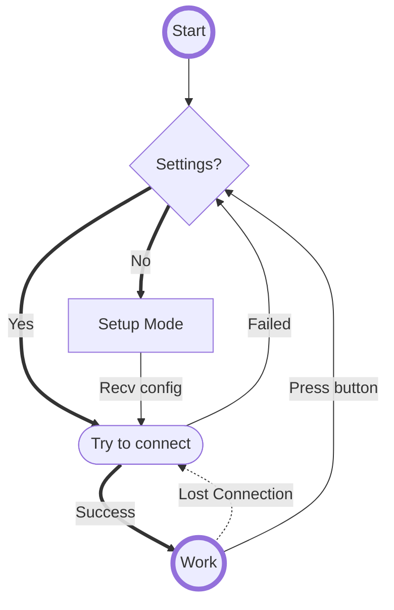
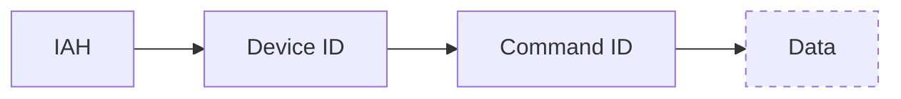
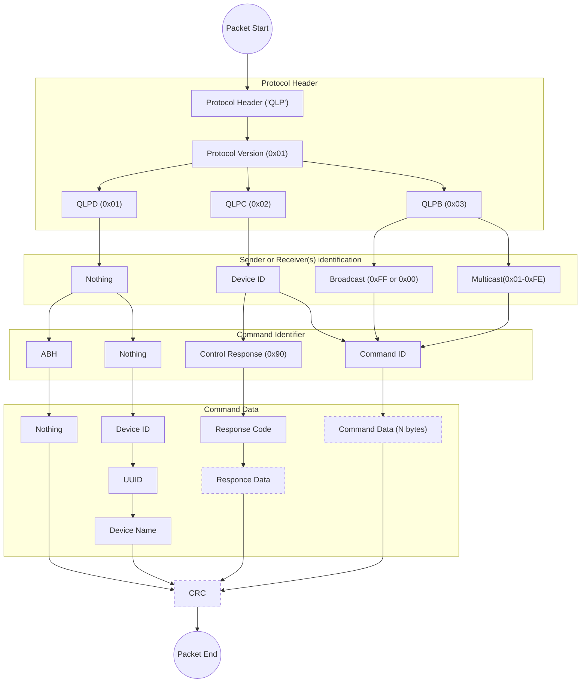

# Quantum0's Led Strip Controller
*Версия документации от 26 февраля 1:30*
*Требуются правки!!!*

## Оглавление

- Алгоритм подключения
- Идентификация
- Индикация
- Протокол

## Алгоритм подключения

## Идентификация
При запуске устройство проверяет наличие UUID в памяти, если его нет - генерирует рандомный

## Индикация
**В качестве индикации состояния контроллера используется первый светодиод ленты и светодиод чипа**

| Режим | Светодиод ленты | Светодиод чипа |
|:---|:---:|:---:|
| Первый запуск | Моргает всеми цветами | :white_check_mark: |
| Подключено, нет настроек | Желтый, моргает | Короткое медленное моргание |
| Режим конфигурации | Синий, моргает | Быстро моргает |
| Подключение к сети | Зелёный, медленно моргает | Медленное моргание |
| Ошибка подключения | Красный, моргает | :white_check_mark: |
| Обычный режим работы | Не используется | :x: |

## Протокол
Для управления будет использоваться **UDP** на порту **52075**

Протокол управления состоит из 3 под-протоколов:
- **QLP Discovery** - протокол поиска устройств **QLSC** в сети
- **QLP Broadcast** - протокол массового управления устройствами **QLSC**
- **QLP Control** - протокол управления конкретным устройством **QLSC**

Все внутренние пакеты шифруются с помощью **XOR** *(Слабовато, но для минимальной безопасности пойдёт)*

Общий формат пакета:

### Протокол обнаружения (*QLP Discovery*)
__Protocol ID = 1__

**Формат пакета запроса:**

*ABH = Anybody here?*

**Формат пакета ответа:**

*Device ID = ID чипа ESP*
*UUID = Собственный сгенерированный ID формата UUID*

### Протокол управления(*QLP Control*)
__Protocol ID = 2__

**Формат пакета запроса:**

*IAH = I am here!*
(*хз, нужен ли IAH или убрать* :thinking:)

**Список команд:**
| Категория | Номер команды | Код команды | Описание команды | Данные | Реализовано | Поддержка BC/MC |
| --- | --- | --- | --- | --- | --- | --- |
| 1.Настройки | 1.Длина ленты | 0x01 | Установка длины ленты | Unsigned int, 2 bytes |
|| 2.Максимальный ток | 0x02 | Установка максимального тока на ленте | Unsigned int, 2 bytes, in milliamper |
|| 3-15.Reserved | 0x03-0x0F | RESERVED | RESERVED |
| 2.Внутренняя сеть | 1.Set master | 0x11 | Устанавливает контроллер мастером, чтоб тот рассылал пакет синхронизации (общий или в мультикаст группе) | 0 - Выкл, 1 - Мультикаст мастер, 2 - Общий мастер
|| 2.Get master | 0x12 | Поиск мастер-контроллера + Ответ от него | NO DATA - запрос, 0-2 - ответ |
|| 3.Sync Packet | 0x12 | Пакет синхронизации для синхронных режимов | NO DATA |
|| 4.Multicast Group | 0x14 | Устанавливает или запрашивает мультикаст группу | NO DATA for Request, 0 - Disable, 1-255 - Set
|| 5.Responce MCG | 0x15 | Сообщает текущую мультикаст группу |
|| 6-31.Reserved | 0x16-0x2F | RESERVED | RESERVED |
| 3.Высокоуровневое управление | 1.Режим | 0x31 | Устанавливает режим работы | Unsigned int, 2 bytes, 0 - без режима |
|| 2.Цвет | 0x32 | Устанавливает или запрашивает цвет | 3 bytes, RGB |
|| 3.Скорость | 0x33 | Устанавливает период полного цикла анимации | Unsigned int, 4 bytes, ms |
|| 4.Яркость | 0x34 | Устанавливает яркость | 0-255 |
|| 5.Сдвиг | 0х35 | Устанавливает сдвиг цикла анимации | 0-255 |
|| 6.Форма | 0x36 | Указывает как подключена лента | 0 - прямая, 1 - circle, 2 - square, 3 - matrix parallel, 4 - matrix snake |
|| 7.Param1 | 0x37 | Установка/запрос параметра для режима | 2 bytes |
|| 8.Param2 | 0x38 | Установка/запрос параметра для режима | 2 bytes |
|| 9-31.Reserved | 0x39-0x4F | RESERVED | RESERVED |
| 4.Низкоуровневое управление | 1.Set pixel color | 0x51 | Устанавливает один пиксель на ленте | Pos [2 bytes] + Color [3 bytes]
|| 2.Set line color | 0x52 | Закрашивает линию определённым цветом | Pos X [2 bytes] + Pos Y [2 bytes] + Color [3 bytes]
|| 3.Gradient | 0x53 | Закрашивает отрезок определённым цветом | Pos X [2 bytes] + Pos Y [2 bytes] + Color X [3 bytes] + Color Y [3 bytes]
|| 4.Fill | 0x54 | Закрашивает всю ленту | Color [3 bytes]
|| 5.Set line image | 0x55 | Устанавливает цвета для каждого пикселя отрезка ленты | Pos X [2 bytes] + Len [1 byte] + Colors [N * 3 bytes]
|| 6.Set all | 0x56 | Устанавливает на ленте все пиксели | Colors [N * 3 bytes]
| 5.Сервисное управление | 1.Шифрование | 0x71 | Включает/выключает шифрование протокола | Флаги - 1) XOR 2) CRC check 3) Common Feedback (вкл/выкл общие ответы)
|| 2.Version | 0x72 | Запрос/получение версии | NO DATA - запрашивает версию, Unsigned int [4 bytes] - ответ (2 - major, 2 - minor)
|| 3.Reset ID | 0x73 | Заставляет контроллер сбросить собственный идентификатор | NO DATA / UUID - ответ |
|| 4.Reboot | 0x74 |Перезагрузка контроллера | NO DATA |
|| 5.Full reset | 0x75 | Сбрасывает все настройки | NO DATA |
| 6.Time control | 1.Set time server | 0x81 | Устанавливает сервер времени | URL
|| 2.Set time | 0x82 | Устанавливает время вручную | HH:MM:SS
|| 3.Set timer | 0x83 | Устанавливает таймер | Timer ID + HH:MM + Brightness, Timer ID + EOF to turn off |
|| 4.Get timer | 0x84 | Запрашивает таймер(ы) | Timer ID or NO DATA for all |

**Формат пакета общего ответа:**

**Коды общих ответов:**
| Ответ | Описание | Response Code | Data |
| --- | --- | --- | -- |
| OK | Команда выполнена успешно | 0x00 | NO DATA |
| Version Error | Ошибка версии протокола | 0x01 | NO DATA |
| CRC Error | Ошибка вычисления контрольной суммы | 0x02 | NO DATA |
| XOR Error | Полученный пакет был зашифрован, но на устройстве отключено шифрование | 0x03 | NO DATA |
| Length Error | Принят пакет неверной длины | 0x04 | NO DATA |
| RESERVED | RESERVED | 0x05-0xFE | RESERVED |
| Other Error | Другая ошибка | 0xFF | Error text |

### Протокол управления(*QLP Broadcast*)
__Protocol ID = 3__

Аналогичен протоколу **QLPC** за исключением того, что вместо **Device ID** передаётся **Broadcast/Multicast Group ID**.
На *broadcast*/*multicast* команды контроллер __не__ отправляет ответ.
Некоторые команды __не__ работают через BC/MC:
- 1.Настройки
	- Все
- 2.Внутренняя сеть:
	- 1.Set master
- 5.Сервисное управление
	- Все

*(Возможно какие-то ещё, надо подумать)*

### Полная схема парсинга пакетов

